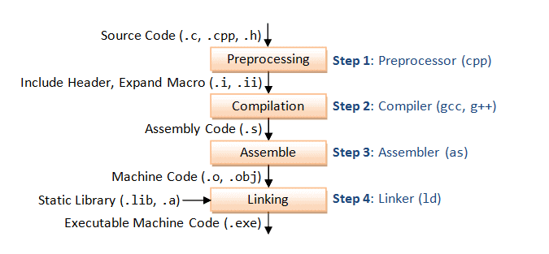

# ADVANCE C/C++
## Compiler
    Compiler là quá trình biên dịch chương trình do người dùng viết bằng ngôn ngữ lập trình (C,C++,Java...) thành ngôn ngữ mà máy có thể hiểu được (machine code)
    Quá trình Compiler có 4 bước
    
    + Bước 1 (Preprocessing) : chuyển source code (.c, .cpp) thành file (.i)
    'gcc -E file.c -o file.i'

## Macro

